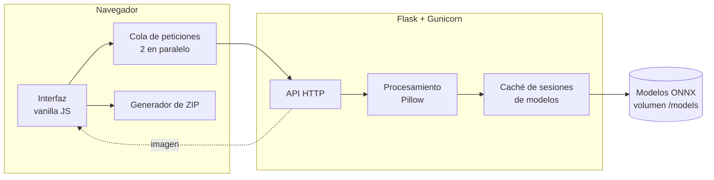

<div align="center">


# Quitafondos

[English](README.md) · **Español**

**Eliminador de fondos en lote con IA, autoalojado.**
Sube decenas de imágenes a la vez, ajusta el resultado y descárgalas todas en un ZIP — todo se ejecuta en tu propio servidor.


[](https://github.com/David-Raffo/Img-background-remover/actions/workflows/ci.yml)


<picture>
  <source media="(prefers-color-scheme: dark)" srcset="docs/img/app-dark.png">
  
</picture>

</div>

---

## Descripción general

Quitafondos es una aplicación web que elimina el fondo de muchas imágenes de una sola vez. Se ejecuta en un contenedor Docker en tu propio equipo o servidor y se usa desde cualquier navegador, así que las fotos nunca se suben a un servicio de terceros.

Las imágenes se procesan en memoria con [rembg](https://github.com/danielgatis/rembg) y nunca se escriben en disco. Cada imagen se envía como una petición independiente, de modo que la interfaz muestra el progreso de cada una, una imagen que falla se puede reintentar por separado y los resultados aparecen en cuanto están listos.

## Funcionalidades

### Procesamiento en lote
- **Arrastrar y soltar, selector de archivos o pegar** (<kbd>Ctrl</kbd>+<kbd>V</kbd>) hasta 50 imágenes por lote.
- **Procesamiento en paralelo** con estado por imagen (pendiente, procesando, listo, error), barra de progreso del lote y reintento con un clic.
- **Descarga individual o todo en un ZIP**, generado en el navegador sin volver a procesar nada.

### Resultados
- **Comparador antes/después** en cada resultado para revisar el recorte.
- **Cinco modelos de IA**: uso general, alta precisión, personas, anime/ilustraciones y uno rápido y ligero.
- **Formato de salida**: PNG, WebP o JPG.
- **Fondo**: transparente, blanco o cualquier color sólido.
- **Recorte automático** al sujeto y **bordes finos** (alpha matting) para pelo y contornos difusos.
- Opción de **tamaño máximo** para acelerar fotos muy grandes.
- Corrección automática de la **orientación EXIF** de las fotos de móvil.

### Interfaz
- Tema claro y oscuro según el sistema, con selector manual.
- Los ajustes se recuerdan entre sesiones.
- Diseño adaptado a móviles y tablets.

## Arquitectura



| Capa | Tecnología |
|---|---|
| Backend | Python, Flask, Gunicorn |
| Procesamiento de imagen | rembg, ONNX Runtime, Pillow |
| Frontend | HTML, CSS y JavaScript sin frameworks ni compilación |
| Despliegue | Docker / Docker Compose |
| Calidad | pytest, ruff, GitHub Actions |

## Cómo funciona

**Una petición por imagen.** El navegador mantiene una cola y envía dos imágenes a la vez a `/api/remove` junto con las opciones elegidas. Así el consumo de memoria del servidor es predecible y la interfaz actualiza cada tarjeta de forma independiente.

**Las sesiones de los modelos se reutilizan.** Cargar un modelo lleva varios segundos, por eso cada uno se carga una sola vez por proceso y se guarda en caché. Los modelos que no vienen incluidos en la imagen se descargan la primera vez que se usan y se guardan en el volumen `/models`.

**Postprocesado.** Cuando rembg genera la máscara alfa, Pillow recorta opcionalmente al contorno del sujeto, compone un fondo de color y codifica el resultado en el formato pedido.

**ZIP en el navegador.** Los resultados ya están en el navegador, así que el ZIP se genera en el cliente en lugar de volver a procesar el lote en el servidor.

**Arranque rápido en Docker.** `pymatting`, que usa rembg, compila funciones con Numba al importarse. La imagen las precompila durante el build y guarda la caché en `NUMBA_CACHE_DIR`, lo que reduce la primera petición de unos 60 s a unos 2 s.

## Puesta en marcha

### Requisitos
- Docker y Docker Compose

### Ejecutar

```bash
git clone https://github.com/David-Raffo/Img-background-remover.git
cd Img-background-remover
docker compose up -d --build
```

Abre <http://localhost:5000>.

El modelo `u2net` se descarga durante el build. Para incluir más modelos en la imagen:

```bash
docker compose build --build-arg PRELOAD_MODELS="u2net isnet-general-use"
```

### Ejecutar sin Docker

Requiere Python 3.11 o superior.

```bash
python -m venv .venv
source .venv/bin/activate
pip install -r requirements.txt
gunicorn app:app
```

### Configuración

| Variable | Por defecto | Descripción |
|---|---|---|
| `PORT` | `5000` | Puerto HTTP dentro del contenedor. |
| `HOST_PORT` | `5000` | Puerto publicado por Docker Compose. |
| `REMBG_MODEL` | `u2net` | Modelo seleccionado por defecto. |
| `MAX_UPLOAD_MB` | `200` | Tamaño máximo de cada petición en MB. |
| `MAX_FILES` | `50` | Número máximo de imágenes por lote. |
| `WORKERS` | `1` | Procesos de Gunicorn (cada uno carga sus propios modelos). |
| `THREADS` | `4` | Hilos por proceso. |
| `TIMEOUT` | `300` | Tiempo máximo por petición en segundos. |
| `LOG_LEVEL` | `INFO` | Nivel de log. |

### Modelos

| Clave | Recomendado para |
|---|---|
| `u2net` | Uso general, buen equilibrio |
| `isnet-general-use` | Mayor precisión en los bordes |
| `u2net_human_seg` | Retratos y personas |
| `isnet-anime` | Anime e ilustraciones |
| `silueta` | El más rápido y ligero, algo menos preciso |

## API

| Método | Endpoint | Uso |
|---|---|---|
| `POST` | `/api/remove` | Procesa una imagen y devuelve el resultado |
| `POST` | `/` | Procesa varias imágenes (campo `images`) y devuelve un ZIP, o la imagen si solo hay una |
| `GET` | `/api/models` | Modelos disponibles y el modelo por defecto |
| `GET` | `/health` | Healthcheck |

Opciones que aceptan `/api/remove` y `/`:

| Campo | Valores |
|---|---|
| `image` | Archivo JPG, PNG, WebP, BMP o TIFF (obligatorio) |
| `model` | Una de las claves de modelo |
| `format` | `png` (por defecto), `webp`, `jpg` |
| `background` | `transparent` (por defecto) o un color como `#ffffff` |
| `crop` | `1` para recortar al sujeto |
| `alpha_matting` | `1` para bordes finos |
| `max_size` | Lado máximo en px (64–10000) |

```bash
curl -F image=@foto.jpg -F format=webp -F crop=1 http://localhost:5000/api/remove -o foto.webp
curl -F images=@a.jpg -F images=@b.png http://localhost:5000/ -o resultado.zip
```

Los errores se devuelven como JSON `{"error": "..."}` con código `400`, `413`, `415`, `422` o `500`. El endpoint de lote añade al ZIP un archivo `errores.txt` con las imágenes que fallaron. Las respuestas correctas incluyen la cabecera `X-Processing-Time`.

## Desarrollo

```bash
pip install -r requirements-dev.txt
pytest
ruff check . && ruff format --check .
```

Los tests simulan rembg, así que tardan menos de un segundo y no descargan ningún modelo.

## Estructura del proyecto

```
Img-background-remover/
├── app.py              # Rutas Flask y factoría de la aplicación
├── processing.py       # Carga de imágenes, opciones y eliminación del fondo
├── gunicorn.conf.py    # Configuración del servidor de producción
├── templates/
│   └── index.html
├── static/
│   ├── css/styles.css
│   ├── js/app.js       # Cola de subida, galería, comparador y ajustes
│   ├── js/zip.js       # Generador de ZIP en el navegador
│   └── favicon.svg
├── tests/              # Tests con pytest
├── docs/img/           # Capturas
├── Dockerfile
└── docker-compose.yml
```

## Licencia

Publicado bajo la [licencia MIT](LICENSE).

<div align="center"><sub>Hecho por <a href="https://github.com/David-Raffo">David Raffo</a></sub></div>
