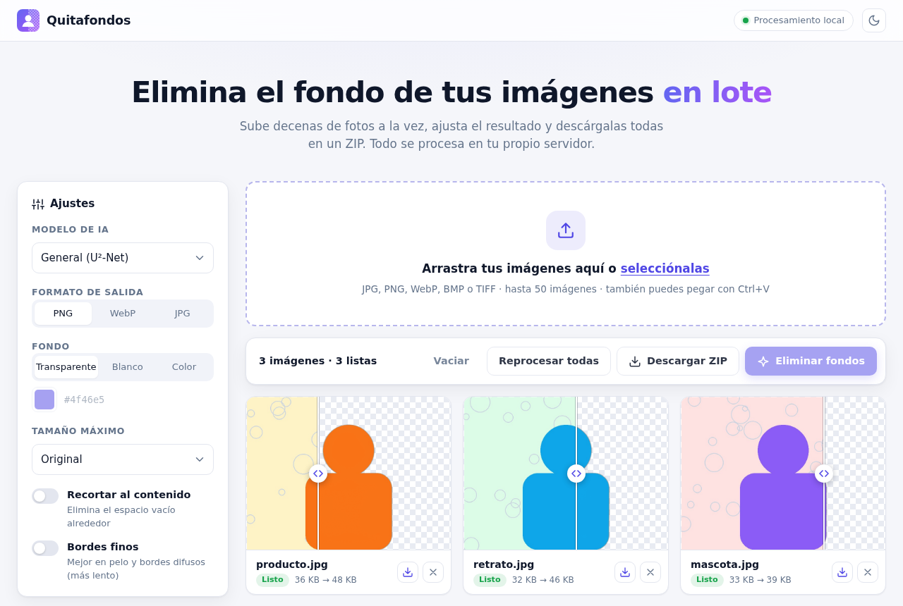
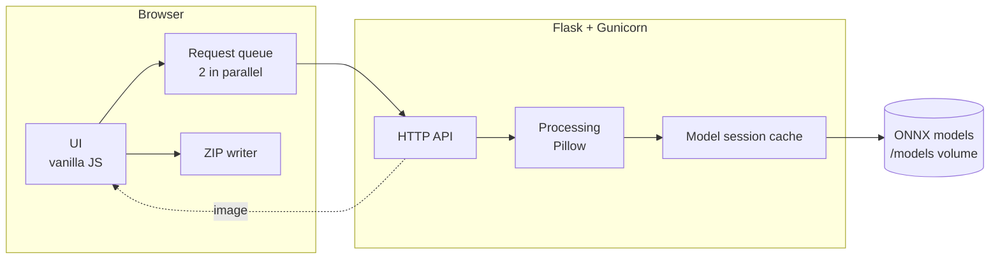

<div align="center">


# Quitafondos

**English** · [Español](README.es.md)

**Self-hosted batch background remover powered by AI.**
Drop dozens of images at once, fine-tune the result and download them all as a ZIP. Everything runs on your own server.

### [▶ Live demo](https://quitafondos.pages.dev)
<sub>The demo runs entirely in your browser, the images never leave your device.</sub>


[](https://github.com/David-Raffo/Img-background-remover/actions/workflows/ci.yml)


<picture>
  <source media="(prefers-color-scheme: dark)" srcset="docs/img/app-dark.png">
  
</picture>

</div>

---

## Overview

Quitafondos is a web app that removes the background from many images in one go. It runs in a Docker container on your own machine or server and is used from any browser, so photos are never uploaded to a third-party service.

Images are processed in memory with [rembg](https://github.com/danielgatis/rembg) and never written to disk. Each image is sent as an independent request, so the interface shows per-image progress, a failed image can be retried on its own and results appear as soon as they are ready.

> The user interface is in Spanish. A Spanish version of this document is available in [README.es.md](README.es.md).

## Features

### Batch processing
- **Drag and drop, file picker or paste** (<kbd>Ctrl</kbd>+<kbd>V</kbd>) up to 50 images per batch.
- **Parallel processing** with per-image status (pending, processing, done, error), batch progress bar and one-click retry.
- **Download one by one or everything as a ZIP**, built in the browser without reprocessing anything.

### Results
- **Before/after slider** on every result to check the cut-out.
- **Five AI models**: general purpose, high precision, people, anime/illustrations and a fast lightweight one.
- **Output format**: PNG, WebP or JPG.
- **Background**: transparent, white or any solid color.
- **Auto-crop** to the subject and **fine edges** (alpha matting) for hair and soft contours.
- **Maximum size** option to speed up very large photos.
- Automatic **EXIF orientation** fix for phone pictures.

### Interface
- Light and dark theme following the system, with a manual toggle.
- Settings are remembered between sessions.
- Responsive layout for phones and tablets.

## Architecture



| Layer | Technology |
|---|---|
| Backend | Python, Flask, Gunicorn |
| Image processing | rembg, ONNX Runtime, Pillow |
| Frontend | HTML, CSS and vanilla JavaScript, no framework, no build step |
| Deployment | Docker / Docker Compose |
| Quality | pytest, ruff, GitHub Actions |

## How it works

**One request per image.** The browser keeps a queue and sends two images at a time to `/api/remove` together with the selected options. This keeps memory usage predictable on the server and lets the UI update each card independently.

**Model sessions are reused.** Loading a model takes seconds, so each one is loaded once per process and cached. Models that are not baked into the image are downloaded on first use and stored in the `/models` volume.

**Post-processing.** After rembg produces the alpha mask, Pillow optionally crops to the bounding box of the subject, composites a solid background and encodes the result in the requested format.

**ZIP in the browser.** Results are already in the browser, so the ZIP is assembled client-side instead of processing the batch again on the server.

**Fast cold start in Docker.** `pymatting`, used by rembg, compiles functions with Numba on import. The image precompiles them during the build and keeps the cache in `NUMBA_CACHE_DIR`, cutting the first request from about 60 s to about 2 s.

## Browser demo

The [live demo](https://quitafondos.pages.dev) is a static build of the same interface that runs the model in the browser with [ONNX Runtime Web](https://onnxruntime.ai/docs/tutorials/web/), inside a Web Worker so the page never freezes. It is served as static assets from Cloudflare Workers and has no backend at all, so the photos are never uploaded anywhere.

The worker reproduces what rembg does on the server: the image is scaled to 320×320, normalised with the ImageNet mean and deviation, the predicted mask is rescaled to the original size and used as the alpha channel. Cropping, solid backgrounds, the maximum size and PNG, WebP or JPG output work the same way.

| | Self-hosted | Browser demo |
|---|---|---|
| Models | Five, up to 170 MB | Fast (U²-Netp, 4.4 MB) and General (Silueta, 42 MB) |
| Fine edges (alpha matting) | Yes | No |
| Where images are processed | Your server | The visitor's device |
| TIFF input | Yes | Depends on the browser |

The models are downloaded once and cached by the browser. The build pulls them from npm and checks that each file fits the Cloudflare limit of 25 MB per asset, so no binaries are stored in this repository.

```bash
cd demo
npm ci
npm run build      # writes demo/dist
npm run preview    # serves it on http://localhost:4173
```

It is published with Workers Builds: a Worker named `quitafondos` connected to this repository, with **root directory** `demo`, **build command** `npm ci && npm run build` and **deploy command** `npx wrangler deploy`. `demo/wrangler.jsonc` points Wrangler at `dist`, and the `_headers` file enables cross-origin isolation so ONNX Runtime can use several threads.

## Getting started

### Requirements
- Docker and Docker Compose

### Run

```bash
git clone https://github.com/David-Raffo/Img-background-remover.git
cd Img-background-remover
docker compose up -d --build
```

Open <http://localhost:5000>.

The `u2net` model is downloaded during the build. To bake in more models:

```bash
docker compose build --build-arg PRELOAD_MODELS="u2net isnet-general-use"
```

### Run without Docker

Requires Python 3.11 or newer.

```bash
python -m venv .venv
source .venv/bin/activate
pip install -r requirements.txt
gunicorn app:app
```

### Configuration

| Variable | Default | Description |
|---|---|---|
| `PORT` | `5000` | HTTP port inside the container. |
| `HOST_PORT` | `5000` | Port published by Docker Compose. |
| `REMBG_MODEL` | `u2net` | Model selected by default. |
| `MAX_UPLOAD_MB` | `200` | Maximum request size in MB. |
| `MAX_FILES` | `50` | Maximum number of images per batch. |
| `WORKERS` | `1` | Gunicorn processes (each one loads its own models). |
| `THREADS` | `4` | Threads per process. |
| `TIMEOUT` | `300` | Request timeout in seconds. |
| `LOG_LEVEL` | `INFO` | Log level. |

### Models

| Key | Best for |
|---|---|
| `u2net` | General use, good balance |
| `isnet-general-use` | Higher precision on edges |
| `u2net_human_seg` | Portraits and people |
| `isnet-anime` | Anime and illustrations |
| `silueta` | Fastest and lightest, slightly less accurate |

## API

| Method | Endpoint | Purpose |
|---|---|---|
| `POST` | `/api/remove` | Process one image and return the result |
| `POST` | `/` | Process several images (`images` field) and return a ZIP, or the image if there is only one |
| `GET` | `/api/models` | Available models and the default one |
| `GET` | `/health` | Health check |

Options accepted by `/api/remove` and `/`:

| Field | Values |
|---|---|
| `image` | JPG, PNG, WebP, BMP or TIFF file (required) |
| `model` | One of the model keys |
| `format` | `png` (default), `webp`, `jpg` |
| `background` | `transparent` (default) or a color such as `#ffffff` |
| `crop` | `1` to crop to the subject |
| `alpha_matting` | `1` for fine edges |
| `max_size` | Longest side in px (64 to 10000) |

```bash
curl -F image=@photo.jpg -F format=webp -F crop=1 http://localhost:5000/api/remove -o photo.webp
curl -F images=@a.jpg -F images=@b.png http://localhost:5000/ -o result.zip
```

Errors are returned as JSON `{"error": "..."}` with status `400`, `413`, `415`, `422` or `500`. The batch endpoint adds an `errores.txt` file to the ZIP listing any image that failed. Successful responses include an `X-Processing-Time` header.

## Development

```bash
pip install -r requirements-dev.txt
pytest
ruff check . && ruff format --check .
```

The tests mock rembg, so they run in under a second and do not download any model.

## Project structure

```
Img-background-remover/
├── app.py              # Flask routes and application factory
├── processing.py       # Image loading, options and background removal
├── gunicorn.conf.py    # Production server settings
├── templates/
│   └── index.html
├── static/
│   ├── css/styles.css
│   ├── js/app.js       # Upload queue, gallery, comparison slider, settings
│   ├── js/zip.js       # Client-side ZIP writer
│   └── favicon.svg
├── demo/               # Browser demo for Cloudflare Workers
│   ├── build.mjs       # Builds demo/dist from templates/ and static/
│   └── src/            # Web Worker with ONNX Runtime Web, bridge and headers
├── tests/              # pytest suite
├── docs/img/           # Screenshots
├── Dockerfile
└── docker-compose.yml
```

## Contributing

Contributions are welcome. Read [CONTRIBUTING.md](CONTRIBUTING.md) before opening a pull request, and report security issues as described in [SECURITY.md](SECURITY.md). Release notes are kept in [CHANGELOG.md](CHANGELOG.md).

## License

Released under the [MIT License](LICENSE).

<div align="center"><sub>Built by <a href="https://github.com/David-Raffo">David Raffo</a></sub></div>
