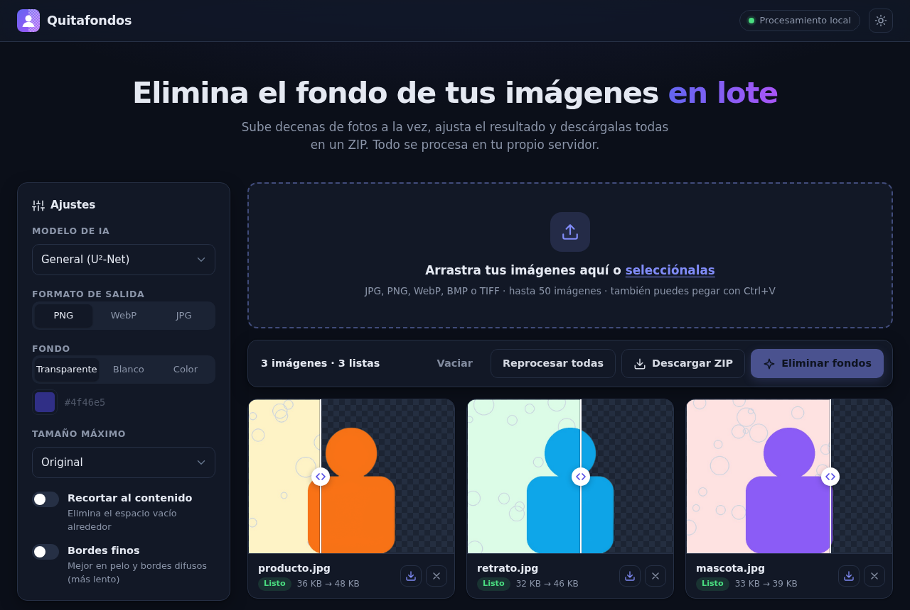

<div align="center">


# Quitafondos

**Elimina el fondo de decenas de imágenes a la vez, en tu propio servidor.**

[](https://github.com/David-Raffo/Img-background-remover/actions/workflows/ci.yml)


</div>

## Características

- **Procesamiento en lote**: arrastra, selecciona o pega (Ctrl+V) hasta 50 imágenes y procésalas en paralelo.
- **Comparador antes/después** en cada imagen para revisar el recorte.
- **Varios modelos de IA** ([rembg](https://github.com/danielgatis/rembg)): general, alta precisión, personas, anime y uno ligero.
- **Salida configurable**: PNG, WebP o JPG, fondo transparente, blanco o de cualquier color.
- **Recorte automático** al contenido y **bordes finos** (alpha matting) para pelo y contornos difusos.
- **Redimensionado** opcional para acelerar fotos muy grandes.
- **Descarga individual o en ZIP**, generado en el navegador sin volver a procesar.
- **Modo oscuro**, ajustes que se recuerdan y diseño adaptado a móvil.
- **Privado**: las imágenes se procesan en memoria y nunca se guardan en disco.
- **API HTTP** sencilla para integrarlo en otros flujos.

<details>
<summary>Modo oscuro</summary>

</details>

## Inicio rápido con Docker

```bash
git clone https://github.com/David-Raffo/Img-background-remover.git
cd Img-background-remover
docker compose up -d --build
```

Abre [http://localhost:5000](http://localhost:5000).

El modelo `u2net` se descarga durante el build. Para incluir más modelos en la imagen:

```bash
docker compose build --build-arg PRELOAD_MODELS="u2net isnet-general-use"
```

Los modelos que no estén precargados se descargan la primera vez que se usan y se guardan en el volumen `models`.

## Ejecución local

Requiere Python 3.11 o superior.

```bash
python -m venv .venv
source .venv/bin/activate
pip install -r requirements.txt
python app.py
```

Para producción usa gunicorn, que lee `gunicorn.conf.py`:

```bash
gunicorn app:app
```

## Configuración

| Variable        | Por defecto | Descripción                                        |
| --------------- | ----------- | -------------------------------------------------- |
| `PORT`          | `5000`      | Puerto HTTP                                        |
| `REMBG_MODEL`   | `u2net`     | Modelo seleccionado por defecto                    |
| `MAX_UPLOAD_MB` | `200`       | Tamaño máximo de cada petición en MB               |
| `MAX_FILES`     | `50`        | Número máximo de imágenes por lote                 |
| `WORKERS`       | `1`         | Procesos de gunicorn (cada uno carga sus modelos)  |
| `THREADS`       | `4`         | Hilos por proceso                                  |
| `TIMEOUT`       | `300`       | Tiempo máximo por petición en segundos             |
| `LOG_LEVEL`     | `INFO`      | Nivel de log                                       |
| `HOST_PORT`     | `5000`      | Puerto publicado por docker compose                |

## Modelos disponibles

| Clave               | Uso recomendado                              |
| ------------------- | -------------------------------------------- |
| `u2net`             | Uso general, buen equilibrio                 |
| `isnet-general-use` | Mayor precisión en bordes                    |
| `u2net_human_seg`   | Retratos y personas                          |
| `isnet-anime`       | Anime e ilustraciones                        |
| `silueta`           | Más rápido y ligero, algo menos preciso      |

## API

### `POST /api/remove`

Procesa una imagen y devuelve el resultado.

| Campo           | Tipo    | Valores                                            |
| --------------- | ------- | -------------------------------------------------- |
| `image`         | archivo | JPG, PNG, WebP, BMP o TIFF (obligatorio)           |
| `model`         | texto   | Una de las claves de modelo                        |
| `format`        | texto   | `png` (defecto), `webp`, `jpg`                     |
| `background`    | texto   | `transparent` (defecto) o un color, p. ej. `#fff`  |
| `crop`          | bool    | `1` para recortar al contenido                     |
| `alpha_matting` | bool    | `1` para bordes finos                              |
| `max_size`      | entero  | Lado máximo en px (64-10000)                       |

```bash
curl -F image=@foto.jpg -F format=webp -F crop=1 http://localhost:5000/api/remove -o foto.webp
```

Los errores se devuelven como JSON `{"error": "..."}` con códigos `400`, `413`, `415`, `422` o `500`.

### `POST /`

Acepta varios archivos en el campo `images` (y las mismas opciones). Devuelve la imagen si solo hay una o un ZIP con todas, incluyendo `errores.txt` si alguna falló.

```bash
curl -F images=@a.jpg -F images=@b.png http://localhost:5000/ -o resultado.zip
```

### Otros

- `GET /api/models`: modelos disponibles y el modelo por defecto.
- `GET /health`: healthcheck.

## Desarrollo

```bash
pip install -r requirements-dev.txt
pytest
ruff check . && ruff format --check .
```

Los tests simulan rembg, así que no necesitan descargar modelos.

## Estructura

```
├── app.py              Rutas Flask y factoría de la aplicación
├── processing.py       Carga de imágenes, opciones y eliminación del fondo
├── gunicorn.conf.py    Configuración del servidor de producción
├── templates/          Plantilla HTML
├── static/             CSS, JavaScript y favicon
├── tests/              Tests con pytest
├── Dockerfile
└── docker-compose.yml
```
